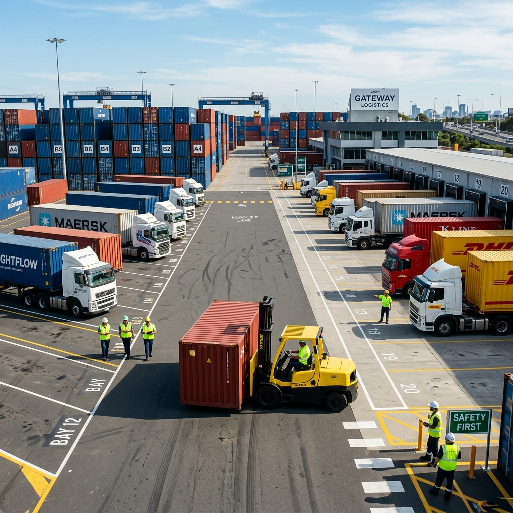
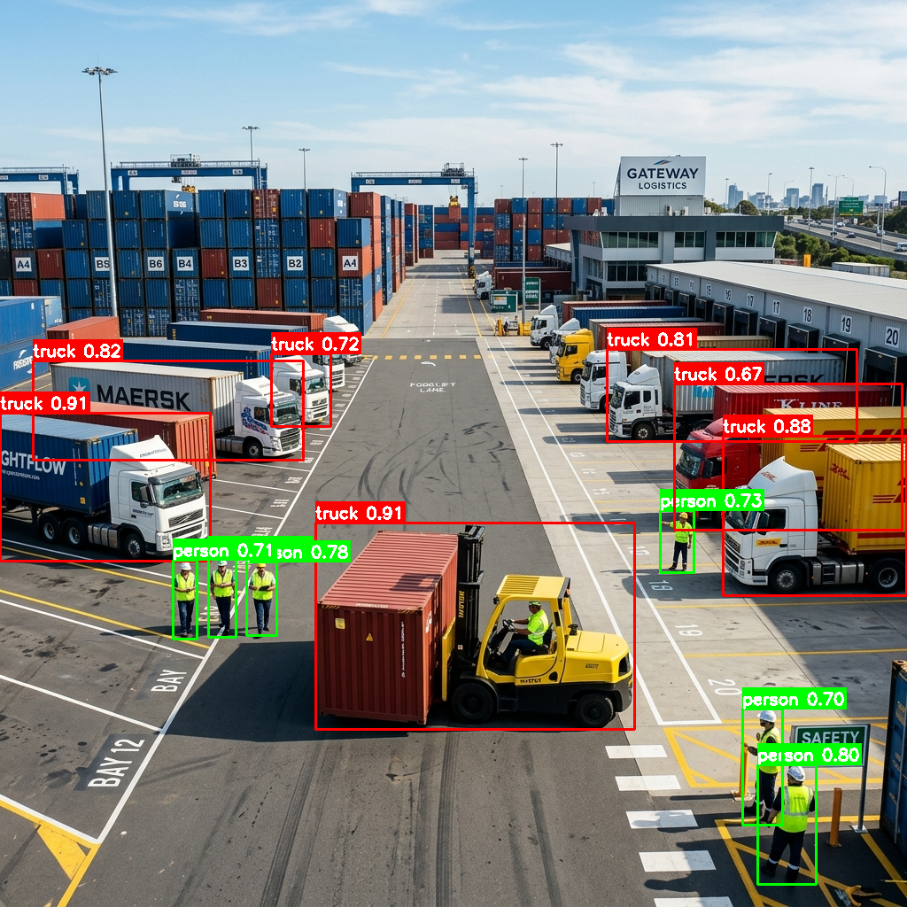

# 🚛 SmartYard — AI-Powered Yard Asset Detection System

> **Enterprise-Ready Computer Vision Pipeline for Logistics & Supply Chain Intelligence**
> Built with YOLOv8 + OpenCV | Architected for High-Performance Yard Management Systems (YMS)

---

## 📌 Project Status: Phase 1 — Architecture Complete ✅

SmartYard is an end-to-end computer vision system designed to automate yard visibility. The current milestone establishes a **high-performance modular architecture** that bridges raw AI inference with actionable logistics insights.

### 🚀 Key Performance Metrics (Benchmarked on RTX 3050)
- **Inference Latency:** ~82 ms / image
- **Throughput:** ~12.17 FPS
- **Pipeline Depth:** Single-stage Ingestion to Structured Reporting

---

## 📷 System Showcase

| Original Yard Image (Input) | AI-Detected Assets & Insight (Output) |
| :--- | :--- |
|  |  |

---

## 🛠️ Enterprise Modular Architecture
The system is built on a "Core Engine vs. Business Analytics" separation, mirroring professional enterprise software design for scalability and maintainability.

```bash
smartyard/
├── src/
│   ├── core/           # Pure AI Engine (YOLOv8 Inference, Preprocessing)
│   ├── analytics/      # Logistics Insights (Zone Mapping, Compliance, Reporting)
│   └── utils/          # Shared CV & File Helpers
├── scripts/            # System Setup & Verification Utilities
├── config/             # Zone Definitions & Asset Configs
├── models/             # Production Weights (Baseline & Fine-tuned)
└── data/               # Raw, Processed, and Verification Assets
```

---

## 🎯 Current Functionality
- **Asset Detection**: Real-time identification of Trucks, Containers, Forklifts, and Personnel.
- **Zone Occupancy**: Automated mapping of assets to predefined yard sectors (e.g., Bay 12, Gate Entry).
- **Safety Compliance**: Automated monitoring for safety gear (helmets/vests) with pass/fail scoring.
- **Gate entry Logging**: High-speed logging of vehicle movements with unique Entry IDs and timestamps.
- **Structured Reporting**: Automated export of JSON and CSV data for integration with enterprise ERP/WMS.

---

## 🗺️ Project Roadmap

- **✅ Phase 1 — Environment & Foundation**: System architecture, baseline performance benchmarking, and pipeline verification.
- **⏳ Phase 2 — Dataset Ingestion**: Scaling to 100K+ logistics images via Roboflow API for domain-specific fine-tuning.
- **📅 Phase 3 — Domain Fine-Tuning**: Optimizing model accuracy for specialized yard assets and edge-case compliance monitoring.
- **📅 Phase 4 — Production Dashboard**: Advanced Streamlit-based UI for multi-camera streams and historical anomaly reporting.

---

## ⚙️ Quick Start

### 1. Installation
```bash
git clone https://github.com/naveena0308/SmartYard.git
cd SmartYard
pip install -r requirements.txt
```

### 2. Verify Setup & Benchmark
```bash
python scripts/setup.py
```

### 3. Run Pipeline Demo
```bash
python main.py --input data/test_images/yard_test_1.png
```

### 4. Launch Dashboard
```bash
streamlit run src/dashboard.py
```

---

## 🚀 Next Steps
This project is currently ongoing. The upcoming focus areas are:
1. **Scale Data**: Ingesting 100K+ images for logistics-specific fine-tuning.
2. **Refine Accuracy**: Training the model on specialized yard assets and safety PPE.
3. **Advanced Alerts**: Expanding the anomaly engine for complex yard violations.

For the full technical breakdown, see the **[Detailed Project Roadmap (plan.md)](plan.md)**.

---
## 🏆 Project Highlights
- **Domain Specialization**: Directly addresses Yard Operations needs (Gate logging, Compliance).
- **Architecture**: Modular design ready for CI/CD and edge deployment.
- **Performance**: Validated low-latency metrics suitable for warehouse/terminal environments.

---
*Built with ❤️ for Supply Chain Intelligence | Inspired by Modern Yard Management Systems (YMS)*
